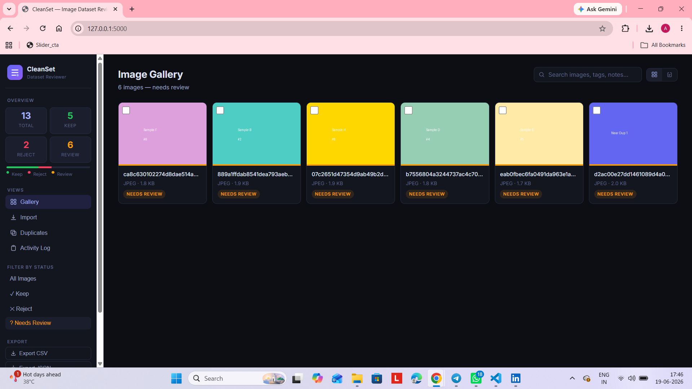
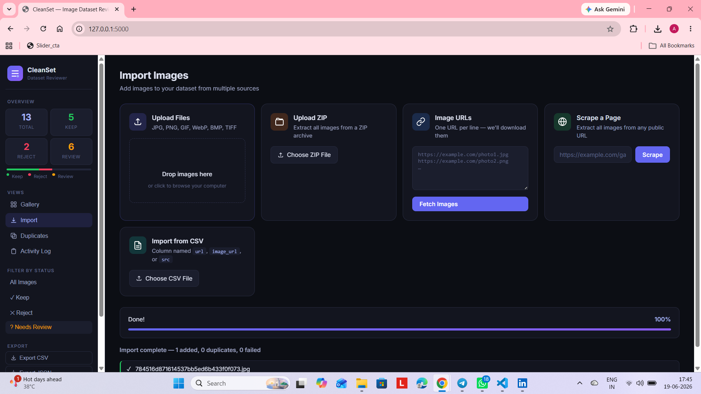
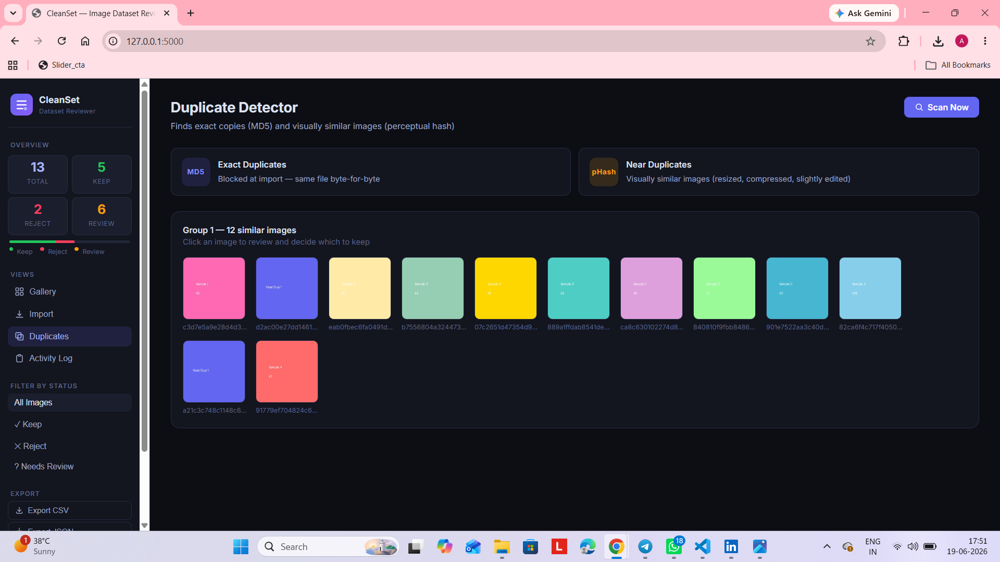
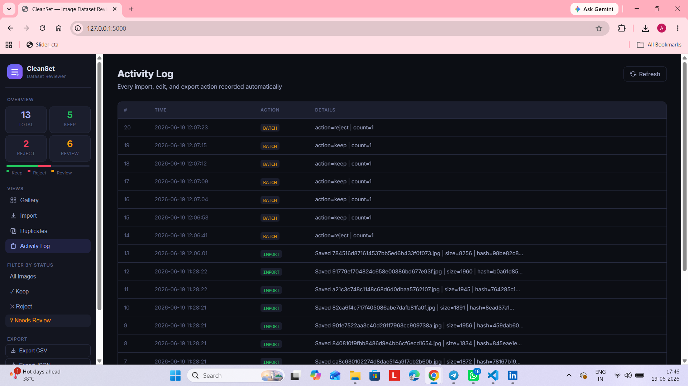
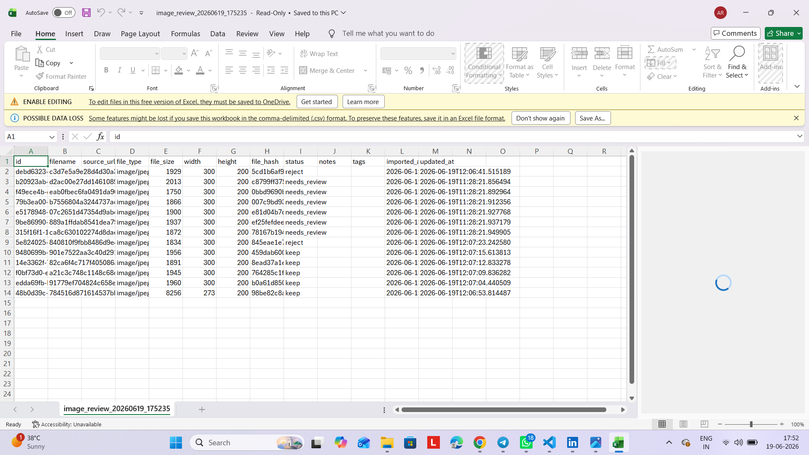

# 🖼 Image Dataset Cleaner & Review Tool

> Rainwater Labs Internship Assignment — Built by Astha

## Screenshots

### Gallery View


### Import Tab


### Duplicate Detection


### Activity Log


### Export Tab


A clean, local web tool to **import, review, tag, deduplicate, and export** image datasets. No cloud accounts needed — everything runs on your machine.

---

## ✨ Features

### Core (Required)
| Feature | Status |
|---------|--------|
| Import images via file upload (30–100 images) | ✅ |
| Import images via ZIP archive | ✅ |
| Import via image URL list | ✅ |
| Import via CSV file (`url`, `image_url`, or `src` column) | ✅ |
| Gallery view (grid + table toggle) | ✅ |
| Per-image metadata: filename, source URL, type, size, dimensions | ✅ |
| Manual review status: `keep`, `reject`, `needs_review` | ✅ |
| Notes and tags per image | ✅ |
| Exact duplicate detection via MD5 hash | ✅ |
| Session persistence via SQLite (reopenable) | ✅ |
| Export as CSV or JSON | ✅ |
| Activity log for all import/edit/save/export actions | ✅ |

### Bonus Features
| Feature | Status |
|---------|--------|
| Near-duplicate detection via perceptual hashing (pHash, threshold ≤10) | ✅ |
| Live public-page image scraping with graceful error handling | ✅ |
| ZIP export of all "keep" images | ✅ |
| Batch actions (mark/delete multiple images at once) | ✅ |
| Search/filter by filename, tags, notes | ✅ |
| Drag-and-drop file upload | ✅ |

---

## 🚀 Setup

### Requirements
- Python 3.10+
- pip

### Install & Run

```bash
# 1. Clone or unzip the project
cd image-review-tool

# 2. Install dependencies
pip install -r requirements.txt

# 3. Start the app
python app.py

# 4. Open in browser
# → http://127.0.0.1:5000
```

That's it. No database setup, no env files, no API keys needed.

---

## 📂 Project Structure

```
image-review-tool/
├── app.py               # Flask backend — all API routes
├── requirements.txt
├── README.md
├── templates/
│   └── index.html       # Single-page UI
├── static/
│   ├── style.css        # Dark-theme UI styles
│   └── script.js        # Frontend logic (vanilla JS)
├── uploads/             # Imported images stored here (auto-created)
├── db/
│   ├── review.db        # SQLite session database (auto-created)
│   └── activity.log     # Text log file (auto-created)
└── sample_input/        # Sample images, ZIP, and CSV for testing
    ├── sample_01.jpg … sample_10.jpg
    ├── neardup_1.jpg
    ├── neardup_2.jpg
    ├── sample_images.zip
    └── sample_urls.csv
```

---

## 🖥 How to Use

### Importing Images
1. **Upload Files** — drag-and-drop or click to browse, supports JPG/PNG/GIF/WebP/BMP
2. **Upload ZIP** — extracts all valid images automatically
3. **Image URLs** — paste URLs (one per line), the tool downloads them
4. **CSV Import** — upload a CSV with `url`, `image_url`, or `src` column; URLs populate the URL import box
5. **Scrape a Page** — enter any public URL, the tool finds all `` tags and lets you import all or individual images

### Reviewing Images
- Click any image card to open the **detail modal**
- Set status: **Keep**, **Reject**, or **Needs Review**
- Add **tags** (comma-separated) and **notes**
- Use the **table view** for bulk overview
- Use **batch actions** to mark or delete multiple images at once

### Finding Duplicates
- Go to the **Duplicates** tab and click **Scan**
- Exact duplicates are rejected at import (MD5 hash check)
- Near-duplicates are grouped by perceptual hash similarity (pHash distance ≤10)

### Exporting
- **Export CSV** — all metadata (or filtered by current status)
- **Export JSON** — same data, structured format
- **Export ZIP** — downloads only images marked as `keep`

---

## 📊 Sample Input / Output

### Sample Input
- `sample_input/sample_images.zip` — 12 colored test images including a near-duplicate pair
- `sample_input/sample_urls.csv` — 3 Wikipedia image URLs

### Sample Output (after reviewing)
```json
[
  {
    "id": "abc123...",
    "filename": "sample_01.jpg",
    "file_type": "image/jpeg",
    "file_size": 4218,
    "width": 300,
    "height": 200,
    "file_hash": "d41d8cd9...",
    "status": "keep",
    "tags": "colorful, test",
    "notes": "Good quality sample",
    "imported_at": "2026-06-15T10:30:00"
  }
]
```

---

## ⚠️ Known Limitations

1. **No AI captions** — AI API integration is not included (as per assignment: optional bonus). To add it, use `ANTHROPIC_API_KEY` and call Claude's vision API per image. Never hardcode the key.

2. **Single-user only** — SQLite with no auth. Not suitable for multi-user/production use.

3. **No database migration** — if the schema changes, delete `db/review.db` and restart.

4. **Scraping** — only public pages are supported. No login bypass, no paywall circumvention, no aggressive crawling. Respects the intent of robots.txt.

5. **Large images** — files over 20 MB per image may be slow; the ZIP upload limit is 200 MB.

6. **No thumbnail caching** — each image is served full-size; very large datasets (1000+ images) may feel slow in the gallery.

---

## 🛠 Tech Stack

| Layer | Technology |
|-------|-----------|
| Backend | Python 3, Flask |
| Database | SQLite (via built-in `sqlite3`) |
| Image processing | Pillow (PIL) |
| Duplicate detection | `hashlib` (MD5) + `imagehash` (pHash) |
| Web scraping | `requests` + `BeautifulSoup4` |
| Frontend | Vanilla HTML/CSS/JS (no framework) |

---

## 🔧 API Reference

| Method | Endpoint | Description |
|--------|----------|-------------|
| GET | `/api/images` | List images (filter: `?status=`, `?search=`) |
| PATCH | `/api/images/<id>` | Update status, tags, notes |
| DELETE | `/api/images/<id>` | Delete image + file |
| POST | `/api/batch` | Batch status/delete |
| POST | `/api/import/files` | Upload image files |
| POST | `/api/import/zip` | Upload ZIP archive |
| POST | `/api/import/urls` | Fetch from image URLs |
| POST | `/api/import/scrape` | Scrape image URLs from a page |
| POST | `/api/import/csv` | Parse URLs from CSV |
| GET | `/api/duplicates` | Find near-duplicate groups |
| GET | `/api/stats` | Summary counts |
| GET | `/api/export/csv` | Download CSV |
| GET | `/api/export/json` | Download JSON |
| GET | `/api/export/zip` | Download ZIP of "keep" images |
| GET | `/api/logs` | Activity log entries |
